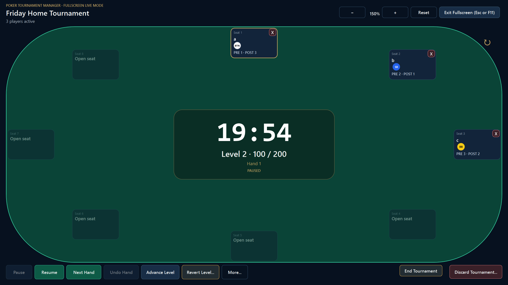
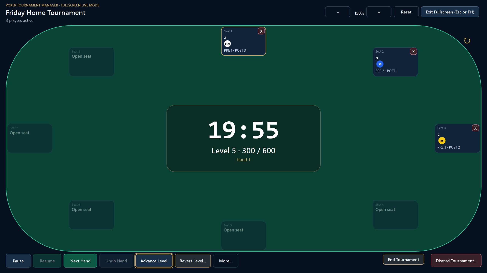
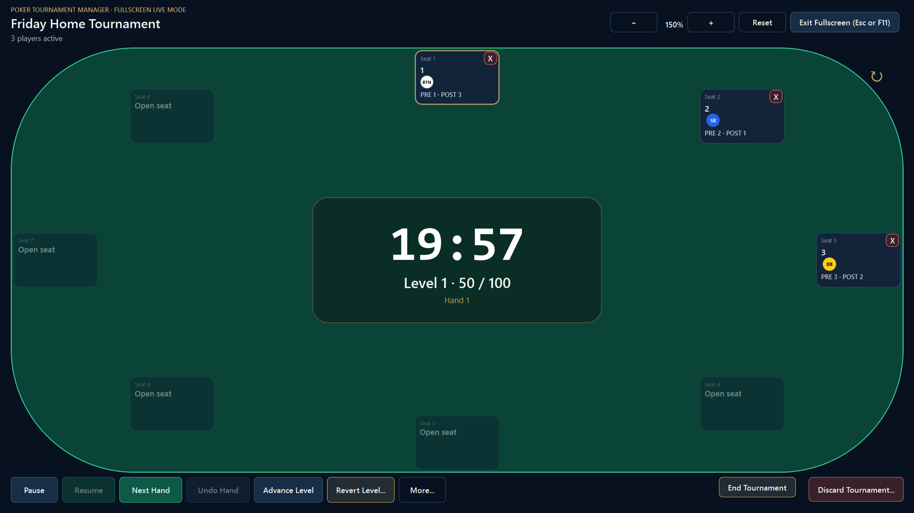

# Poker Tournament Manager

A Windows desktop operations console for running structured single-table No-Limit Hold'em tournaments.

**Latest validated version:** v1.1.1  
**Platform:** Windows x64  
**Project status:** Released and physically validated  
**Public repository scope:** Curated case study, screenshots, architecture summary, and release evidence


## Overview

Poker Tournament Manager is a table-centric desktop application designed to help a host run a live home tournament from one operational workspace.

The project began as a functional tournament administration tool. Real tournament use exposed a different need: the timer, player positions, action order, eliminations, and level controls needed to be visible and reliable during every hand. That feedback drove a live-operations redesign, repeated physical QA, and a focused maintenance release after a break-workflow failure appeared during an actual event.

The core product principle became:

> Information needed every hand belongs on the live table. Occasional administrative actions should not permanently consume screen space.

## My Role

**Product Owner and Release Lead | AI-Assisted Software Development**

I led:

- Product direction and scope control
- Requirements and acceptance criteria
- Tournament-rule interpretation
- UX workflow decisions
- Physical Windows-laptop QA
- Defect reproduction and severity classification
- Regression planning
- Release gating, packaging review, and final acceptance

OpenAI Codex supported implementation and automated-test development. I do not represent the application as entirely hand-coded by me. Product decisions, requirements, physical testing, release approval, and acceptance remained human-directed.

## Technology

| Area | Technology |
|---|---|
| Language | C# |
| Desktop UI | WPF |
| Runtime | .NET 10 |
| Persistence | Entity Framework Core |
| Database | SQLite |
| Testing | xUnit |
| Version control | Git |
| Deployment | Self-contained Windows x64 |

## Key Capabilities

- Fullscreen, table-dominant live tournament workspace
- Blind timer and level controls
- BTN, SB, and BB position tracking
- Preflop and postflop action-order display
- Dead-button and heads-up handling
- Player seating, moves, swaps, and one-step undo
- Inline player registration and editing
- Payment confirmation and prize-pool tracking
- Elimination and most-recent-elimination restoration
- Next Hand and Undo Hand
- Pause, Resume, Advance Level, and Revert Level
- Session-only tournament persistence with recovery support
- Tournament completion, payout reconciliation, and discard
- Offline Windows operation

## Product Evolution

### 1. Live use exposed the real problem

The original application worked, but its workflow was too administration-heavy for live hosting. Important information was split across screens, and several defects appeared only during real use or repeated tournament lifecycles.

### 2. The interface became table-centric

A rough product-direction mockup defined a single fullscreen workspace where the table, timer, positions, and routine controls dominate the screen.

### 3. Physical QA found state and lifecycle defects

Examples included:

- A frontend timer that could stop visibly updating after the first tournament
- Incorrect dead-button behavior around unused or eliminated seats
- A three-player transition defect involving dead positions
- Different behavior between keyboard and visible fullscreen entry paths
- A dedicated break workflow that trapped the tournament at a scheduled boundary

### 4. v1.1.1 simplified break operations

The dedicated `OnBreak` state, separate break countdown, Start Break, End Break, and Complete Color-Up controls were removed.

The host workflow is now:

1. Finish the current hand.
2. Pause the tournament.
3. Conduct the break and any color-up.
4. Advance Level while still paused.
5. Resume play.





## Validation and Release Quality

Version 1.1.1 completed:

| Validation | Result |
|---|---:|
| Core tests | 98 passed |
| Application tests | 6 passed |
| Infrastructure/WPF tests | 170 passed |
| **Total automated tests** | **274 passed** |
| Failed | **0** |
| Skipped | **0** |
| Build warnings | **0** |
| Build errors | **0** |
| EF model/migration parity | PASS |
| NuGet vulnerability audit | PASS |
| Focused physical candidate QA | **5/5 PASS** |
| Final packaged-build QA | **4/4 PASS** |

The verified v1.1.1 ZIP had SHA-256:

```text
43761D555F02B75575E5C138E73D484830C1556306B4A67CB6D2C42BB2BD1912
```

The second-tournament timer regression was also physically confirmed in the packaged build:



## Architecture at a Glance

The implementation follows a layered structure:

- **Core:** tournament rules, seating, payouts, position logic, and clock behavior
- **Application:** workflows, use cases, and ports
- **Infrastructure:** EF Core, SQLite, persistence, migration, backup, and export implementations
- **WPF:** Windows UI, commands, navigation, timer projection, and user interaction

The authoritative timer is timestamp-based. A reusable application-lifetime WPF pulse refreshes the visible projection without writing to SQLite every second.

See [Architecture Overview](docs/ARCHITECTURE_OVERVIEW.md).

## Data and Privacy Design

Tournament data is intentionally session-only rather than a permanent personal poker-history ledger.

- A current tournament may be retained temporarily for crash recovery.
- Confirmed discard removes the active tournament aggregate.
- The application does not enforce personal gambling frequency, budgets, loss limits, or cooldowns.
- Preferences, presets, inventory, reference material, and independent study notes may persist.
- Release packages exclude production databases, backups, logs, exports, and user data.

See [Privacy and Data Design](docs/PRIVACY_AND_DATA_DESIGN.md).

## Public Repository Scope

This repository intentionally presents a curated professional case study rather than the full private development archive.

The private archive contains historical source mappings tied to personal documents and internal QA material. Those materials are not needed to demonstrate the product, architecture, testing, or release process and are intentionally excluded from publication.

This repository contains:

- Curated project overview
- Product and UX case study
- Architecture summary
- QA and release evidence
- Release notes and acceptance report
- Sanitized screenshots

See [Publication Audit](docs/PUBLICATION_AUDIT.md).

## Documentation

- [Case Study](docs/CASE_STUDY.md)
- [Architecture Overview](docs/ARCHITECTURE_OVERVIEW.md)
- [Condensed Code Example](docs/CODE_EXAMPLE.md)
- [QA and Release Process](docs/QA_AND_RELEASE.md)
- [Privacy and Data Design](docs/PRIVACY_AND_DATA_DESIGN.md)
- [Publication Audit](docs/PUBLICATION_AUDIT.md)
- [v1.1.1 Release Notes](releases/RELEASE_NOTES_v1.1.1.md)
- [v1.1.1 Final Acceptance Report](releases/FINAL_ACCEPTANCE_REPORT_v1.1.1.md)

## Known and Deferred Items

- Physical crash-recovery validation was deferred.
- Physical Backup/Restore validation was deferred.
- Legacy-history cleanup validation was deferred.
- A minor DEAD BTN/SB indicator overlap can occur on some eliminated player cards.

These were documented and not represented as physically accepted.

## Development Disclosure

This project used an AI-assisted implementation workflow. My ownership centered on product direction, requirements, acceptance criteria, UX direction, rule interpretation, physical QA, defect triage, release management, and final approval.

## Project Context

Poker Tournament Manager is a recreational home-tournament logistics tool. It is not an online poker service, casino platform, gambling marketplace, or income product.

## License

No open-source license is granted by this repository unless one is added later.
